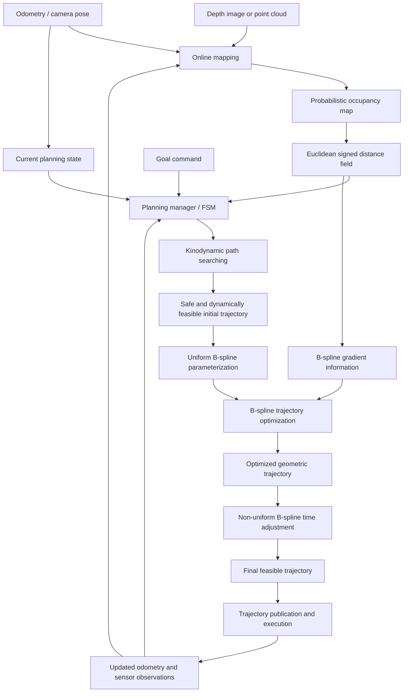

# Fast-Planner System Overview

**Scope:** Kinodynamic path searching + B-spline trajectory optimization pipeline  
**Primary references:** Official Fast-Planner repository and Zhou et al. (RA-L 2019)

---

## 1. Overview

This document explains end-to-end planning pipeline of **Fast-Planner** (from sensor and odometry input to executable quadrotor trajectory output).

The official repository contains several planning methods, including:

- kinodynamic path searching
- B-spline trajectory optimization
- topological path searching
- path-guided optimization
- mapping and simulation modules

However, this document focuses on the baseline pipeline executed by `kino_replan.launch` example:

> **online mapping → kinodynamic A* → B-spline optimization → time adjustment → trajectory execution and replanning**

---

## 2. Problem Definition

Fast-Planner addresses online quadrotor motion planning in unknown or partially known 3D environments.

Given:

- current quadrotor state,
- odometry,
- depth image or point-cloud observations,
- a local map reconstructed from sensor data,
- a target position,
- velocity and acceleration limits,

planner must generate trajectory that is:

1. **Collision-free**  
   The trajectory must avoid occupied space.

2. **Kinodynamically feasible**  
   The motion must respect state-transition model and limits on velocity and acceleration.

3. **Smooth**  
   Abrupt geometric changes should be removed so that the trajectory is trackable.

4. **Computationally efficient**  
   The planner must support repeated replanning during fast flight.

5. **Non-conservative**  
   Dynamic feasibility should not be obtained merely by slowing the entire trajectory excessively.

Fast-Planner solves this problem using a front-end and back-end decomposition:

```text
Online planning = Kinodynamic search + B-spline optimization + Time adjustment
```

---

## 3. Core System Architecture



A simplified view:

```text
Sensor observations + odometry
                ↓
     Occupancy map and ESDF
                ↓
      Current state + goal
                ↓
        Kinodynamic A*
                ↓
 Safe, feasible initial trajectory
                ↓
   B-spline representation
                ↓
 Gradient-based optimization
                ↓
 Iterative knot-span adjustment
                ↓
 Executable trajectory
                ↓
    Replanning with new data
```

The key architectural idea is that Fast-Planner does not solve the entire online planning problem as one monolithic optimization.

Instead, it first obtains reliable initial solution through search and then improves that solution through **OPTIMIZATION**.

---

## 4. Input and Output

### 4.1 Main inputs

| Input | Role in the planner |
|---|---|
| Depth image or point cloud | Provides obstacle observations |
| Camera pose or odometry | Places sensor measurements in the world frame and provides current vehicle state |
| Goal position | Defines destination requested by user or higher-level mission planner |
| Dynamic limits | Define allowable velocity and acceleration |
| Planning parameters | Configure voxel size, map range, search resolution, optimization weights, clearance, and replanning behavior |

### 4.2 Intermediate representations

| Representation | Meaning |
|---|---|
| **ESDF** | Distance from a spatial location to the nearest obstacle, with gradient information |
| **B-spline control points** | Compact optimization variables representing the continuous trajectory |
| Probabilistic occupancy map | Voxel representation of occupied, free, and unknown space |
| Search node | A sampled quadrotor state considered during kinodynamic search |
| Motion primitive | A short dynamically generated trajectory segment produced by applying a sampled control input |
| Initial trajectory | Search result that is safe and dynamically feasible but may be geometrically suboptimal |
| Knot spans | Time intervals controlling trajectory timing and derivative magnitudes |

### 4.3 Main output

The core output is **continuous, time-parameterized quadrotor trajectory**.

At the planning level, trajectory provides quantities such as:

```math
\mathbf{p}(t),\qquad
\mathbf{v}(t)=\dot{\mathbf{p}}(t),\qquad
\mathbf{a}(t)=\ddot{\mathbf{p}}(t)
```
The planner publishes generated trajectory for execution by trajectory server, simulator, or downstream controller.

The low-level attitude and motor controller is conceptually downstream of core planning algorithm and is not main subject of Fast-Planner's trajectory-generation method.

---

## 5. Stage 1 — Online Mapping

### 5.1 Mapping input

The official `plan_env` module receives:

- depth images or point clouds,
- camera pose or odometry.

Observations are fused into a probabilistic volumetric map through raycasting.

```text
Depth measurement
      +
Sensor pose
      ↓
Raycasting through voxels
      ↓
Free-space and occupied-space updates
      ↓
Probabilistic occupancy map
```

### 5.2 Occupancy map

The occupancy map is used by the **search stage** for collision checking.

**Kinodynamic search** primarily needs an answer to:

> Is this motion primitive inside free space?

The quadrotor is handled in configuration space by inflating obstacles and treating the vehicle as a point during collision checking.

### 5.3 ESDF

The mapping system also builds a Euclidean signed distance field.

For a position $\mathbf{x}$, the distance map provides:

```math
d(\mathbf{x})
```
and its spatial gradient:

```math
\nabla d(\mathbf{x})
```
The distance value describes obstacle clearance. The gradient supplies the direction in which the trajectory should move to increase clearance.

This creates a division of responsibility:

- **Occupancy information** supports binary collision checking in search.
- **Distance and gradient information** support continuous trajectory deformation in optimization.

Paper often uses **Euclidean distance field (EDF)**, while the repo-documentation describes the implementation as **ESDF**.

This document uses **ESDF** when discussing the software module.

---

## 6. Stage 2 — Planning Trigger and State Construction

The high-level `plan_manage` package schedules mapping and planning modules and contains launch and configuration interfaces.

Planning cycle begins when a goal or replanning condition is received.

The planner combines:

- current position,
- current velocity,
- target state,
- map information,
- dynamic limits.

For the double-integrator model used in the paper:

```math
\mathbf{x}
=
\begin{bmatrix}
\mathbf{p}\\
\mathbf{v}
\end{bmatrix},
\qquad
\mathbf{u}=\mathbf{a}
```
where:

- $\mathbf{p}$ is position,
- $\mathbf{v}$ is velocity,
- $\mathbf{u}$ is the acceleration-like control input.

This differs from standard grid A*, whose node commonly contains only position or voxel index.

---

## 7. Stage 3 — Front-End Kinodynamic Path Searching

### 7.1 Purpose

Search front-end must quickly produce initial trajectory that is:

- collision-free,
- consistent with the dynamic model,
- feasible under selected motion limits,
- close to minimum time under the chosen search formulation.

### 7.2 Motion primitives

Instead of connecting neighboring voxel centers with straight lines, Kinodynamic A* expands **motion primitives**.

For constant acceleration input $\mathbf{u}$ over duration $\tau$:

```math
\mathbf{p}(t)
=
\mathbf{p}_0+\mathbf{v}_0t+\frac{1}{2}\mathbf{u}t^2
```
```math
\mathbf{v}(t)
=
\mathbf{v}_0+\mathbf{u}t
```
Each candidate primitive is checked for:

- collision,
- velocity feasibility,
- consistency with the state transition,
- search cost.

### 7.3 Search cost

Paper defines trajectory cost that combines control effort and time:

```math
\mathcal{J}(T)
=
\int_0^T \lVert\mathbf{u}(t)\rVert^2\,dt+\rho T
```
First term penalizes control effort.

Second term penalizes duration.

The search therefore does not optimize geometric distance alone.

### 7.4 Heuristic and analytic expansion

Admissible heuristic based on linear-quadratic minimum-time control guides the search toward the goal.

Planner can also attempt an analytic connection from current search node to the goal. If this connection is safe and dynamically feasible, search can terminate earlier.

### 7.5 Search output

Front-end produces a continuous sequence of dynamically generated motion segments.

This output is already safer and more physically meaningful than purely geometric voxel path. However, it can still be:

- close to obstacles,
- unnecessarily curved,
- discretization-dependent,
- insufficiently smooth for high-quality execution.

Therefore, search result is used as an **initial solution**, not the final trajectory.

---

## 8. Stage 4 — B-Spline Trajectory Representation

Fast-Planner represents the optimized trajectory using **B-spline**.

B-spline trajectory is defined by:

- polynomial degree $p_b$,
- control points $\{\mathbf{Q}_0,\dots,\mathbf{Q}_N\}$,
- knot vector $\{t_0,\dots,t_M\}$.

Conceptually:

```math
\mathbf{p}(t)
=
\sum_i \mathbf{Q}_i B_{i,p_b}(t)
```
The paper uses a cubic B-spline:

```math
p_b=3
```
The search trajectory provides initial geometry from which the B-spline trajectory is initialized.

Back-end then optimizes subset of B-spline control points while preserving the boundary state.

### Why B-spline is suitable

1. **Local support**  
   Moving one control point affects only a local portion of curve.

2. **Built-in continuity**  
   The trajectory is smooth without explicitly adding every inter-segment continuity constraint.

3. **Compact variables**  
   Optimization is performed over control points instead of dense trajectory samples.

4. **Derivative structure**  
   Velocity and acceleration are also represented as B-splines.

5. **Convex-hull property**  
   Bounds on derivative control points can be used to reason about the entire continuous trajectory.

---

## 9. Stage 5 — Gradient-Based B-Spline Optimization

### 9.1 Purpose

Back-end improves initial trajectory in three principal aspects:

- smoothness,
- obstacle clearance,
- dynamic feasibility.

The baseline objective in the paper is:

```math
f_{\mathrm{total}}
=
\lambda_1 f_s
+
\lambda_2 f_c
+
\lambda_3(f_v+f_a)
```
where:

- $f_s$: smoothness cost,
- $f_c$: collision or clearance cost,
- $f_v$: velocity-limit penalty,
- $f_a$: acceleration-limit penalty.

### 9.2 Smoothness

Smoothness term treats the control-point sequence similarly to an elastic band.

A strongly bent control-point arrangement produces larger penalty. Optimization tends to distribute the control points more smoothly.

### 9.3 Collision and clearance

For control point $\mathbf{Q}_i$, ESDF supplies:

```math
d(\mathbf{Q}_i)
```
and corresponding gradient.

When the distance is smaller than desired threshold, collision cost pushes the control point away from the obstacle.

```text
Search: Is this primitive collision-free?

Optimization: How far is this control point from an obstacle, and in which direction should it move?
```

### 9.4 Dynamic feasibility

For uniform B-spline with knot interval $\Delta t$, derivative control points are related to position control points.

Paper gives:

```math
\mathbf{V}_i
=
\frac{1}{\Delta t}
\left(\mathbf{Q}_{i+1}-\mathbf{Q}_i\right)
```
```math
\mathbf{A}_i
=
\frac{1}{\Delta t}
\left(\mathbf{V}_{i+1}-\mathbf{V}_i\right)
```
Velocity and acceleration violations can therefore be penalized through derivative control points rather than checking only isolated continuous-time samples.

### 9.5 Optimization output

The optimization produces trajectory with improved geometry and clearance.

However, moving the trajectory away from obstacles may increase its length. If time allocation remains unchanged, this longer geometry can cause velocity or acceleration violations.

---

## 10. Stage 6 — Iterative Time Adjustment

Fast-Planner converts final representation to a non-uniform B-spline and adjusts selected knot spans.

Purpose is to guarantee dynamic feasibility without uniformly slowing the entire trajectory.

For non-uniform B-spline, different trajectory regions may have different knot intervals.

This allows planner to:

- increase time where velocity or acceleration is infeasible,
- preserve shorter timing where the trajectory is already feasible,
- control aggressiveness locally,
- avoid unnecessarily conservative global time scaling.

The iterative procedure is:

```text
Evaluate derivative control points
              ↓
Find velocity or acceleration violations
              ↓
Increase associated knot spans
              ↓
Recompute derivative feasibility
              ↓
Repeat until feasible
```

This stage modifies temporal allocation while preserving the optimized spatial control-point structure.

---

## 11. Stage 7 — Trajectory Publication, Execution, and Replanning

After geometric optimization and time adjustment, final trajectory is published for execution.

In the official simulation:

1. RViz displays the random map and quadrotor.
2. The user selects a goal using `2D Nav Goal`.
3. Fast-Planner generates a trajectory.
4. The simulator executes the trajectory.
5. New sensor and odometry data update the planner.
6. The planner can generate a new trajectory when required.

The system therefore operates as a **closed loop**:

```text
Plan → Execute → Sense → Update map/state → Replan
```

Fast-Planner supports repeated trajectory regeneration as the vehicle moves and new obstacles become observable.

---

## 12. One Complete Planning Cycle

| Step | Operation | Main output |
|---:|---|---|
| 1 | Receive depth image or point cloud | Obstacle measurement |
| 2 | Receive odometry or camera pose | Current pose and state reference |
| 3 | Raycast and update occupancy voxels | Local probabilistic map |
| 4 | Update ESDF | Distance and gradient field |
| 5 | Receive goal or replanning trigger | Planning request |
| 6 | Construct current and target states | Search boundary conditions |
| 7 | Expand dynamically valid motion primitives | Search graph |
| 8 | Check collisions and dynamic limits | Feasible candidate primitives |
| 9 | Apply heuristic and analytic expansion | Faster goal connection |
| 10 | Retrieve initial trajectory | Safe kinodynamic search result |
| 11 | Initialize B-spline control points | Continuous trajectory representation |
| 12 | Optimize smoothness, clearance, and feasibility | Improved spatial trajectory |
| 13 | Detect derivative-limit violations | Infeasible velocity/acceleration regions |
| 14 | Adjust local knot spans | Dynamically feasible timing |
| 15 | Publish final trajectory | Executable reference |
| 16 | Execute and collect new observations | Input for the next planning cycle |

---

## 13. Repository Modules and Their Roles

This table provides only the system-level mapping.

| Repository module | System-level responsibility |
|---|---|
| `plan_env` | Occupancy mapping and ESDF construction |
| `path_searching` | Standard A*, Kinodynamic A*, and topological search algorithms |
| `bspline` | B-spline trajectory representation and evaluation |
| `bspline_opt` | Gradient-based B-spline trajectory optimization |
| `plan_manage` | High-level scheduling, launch files, configuration, and planning interfaces |
| `poly_traj` | Polynomial trajectory utilities used by planning components |
| `traj_utils` | Trajectory-related messages and visualization utilities |
| `uav_simulator` | Lightweight test environment for planner reproduction |

---

## 14. Front-End and Back-End Responsibilities

| Aspect | Front-end Kinodynamic A* | Back-end B-spline optimization |
|---|---|---|
| Main space | Discretized state and control space | Continuous control-point space |
| Main map query | Occupancy and collision checking | ESDF distance and gradient |
| Main objective | Find a valid initial trajectory quickly | Improve smoothness, clearance, and feasibility |
| Dynamic model | Explicitly included in motion propagation | Enforced through derivative control points and penalties |
| Output quality | Feasible but possibly rough or obstacle-adjacent | Smooth and higher-clearance |
| Typical failure risk | Search cannot find a valid connection | Nonlinear optimization may converge to a poor local solution |
| How Fast-Planner improves robustness | Search supplies a physically valid initial solution | Optimization starts from that initial solution instead of an arbitrary curve |

This decomposition is central to Fast-Planner.

A search-only planner can remain rough and discretized. An optimization-only planner can fail without a good initial trajectory. Fast-Planner combines their complementary strengths.

## 15. Key Design Decisions

### 15.1 Why not execute the Kinodynamic A* result directly?

Because the search operates in discretized control space. The result may be feasible but geometrically rough, close to obstacles, or sensitive to discretization.

### 15.2 Why not use only nonlinear optimization?

Because nonlinear trajectory optimization is sensitive to initialization and local minima. A valid kinodynamic search result provides a strong initial solution.

### 15.3 Why use ESDF?

Because collision checking alone gives a binary result. ESDF provides continuous obstacle-distance gradients needed to deform the trajectory.

### 15.4 Why use B-spline?

Because B-spline offers continuity, local support, compact control-point variables, derivative structure, and a useful convex-hull property.

### 15.5 Why adjust time after geometry optimization?

Because pushing a trajectory away from obstacles can increase path length. Keeping the original timing may then violate velocity or acceleration limits.

### 15.6 Why use non-uniform timing?

Because only problematic regions need more time. Uniform scaling would unnecessarily slow feasible portions of the trajectory.

---

## 16. References

1. B. Zhou, F. Gao, L. Wang, C. Liu, and S. Shen, **“Robust and Efficient Quadrotor Trajectory Generation for Fast Autonomous Flight,”** *IEEE Robotics and Automation Letters*, vol. 4, no. 4, pp. 3529–3536, 2019.  
   ArXiv: `1907.01531`

2. HKUST Aerial Robotics Group, **Fast-Planner: A Robust and Efficient Trajectory Planner for Quadrotors**, official GitHub repository.  
   Repository: `HKUST-Aerial-Robotics/Fast-Planner`

3. Fast-Planner official repository documentation for the `plan_env`, `path_searching`, `bspline`, `bspline_opt`, `plan_manage`, and `uav_simulator` modules.

---

## 17. Next Deliverable

The next document is:

```text
02_bspline_and_esdf_notes.md
```

It will study two core mathematical representations used by back-end:

1. B-spline basis, control points, knot vector, local support, derivatives, and convex-hull property.
2. Occupancy map, EDT/EDF/ESDF distinctions, distance queries, gradients, and obstacle-cost construction.
